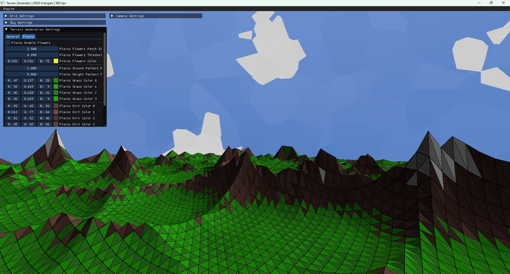

# Stylized Terrain Generator

A **stylized procedural terrain generator** built with _.NET_ and powered by _OpenGL_. 
This project creates low-poly terrains entirely on the GPU, which is generated dynamically as the player flies around.

## Features

- **Stylized Look**: Low-poly, and colorful terrain.
- **GPU Generation**: The terrain is generated completely in the GPU for a better performance.
- **Dynamic LOD**: Automatically adjusts the terrain's level of detail based on the distance to the camera.
- **Real Time Configuration**: Everything can be configured in real time, including the render distance, the level of detail, and the colors of both the terrain and the sky.

## Controls

- **Look**: Use the mouse to look around.
- **Horizontal Movement**: Use `W`, `A`, `S`, `D` to move horizontally.
- **Vertical Movement**: Use `Space` to go up and `Left Control` to go down.
- **Fly Faster**: Use `Left Shift` to increase your flying speed.
- **Mouse**: Press `F1` to enable the mouse and interact with the settings.

## Building and Running the Project

### Option 1 - Using an IDE

You can build and run the project by opening it in your preferred C# IDE (Visual Studio, Rider, VSCode, etc.).

### Option 2 - Using the Run Script

Alternatively, you can simply run the `Run.py` python script, which will automatically build the project and run it from the console.
